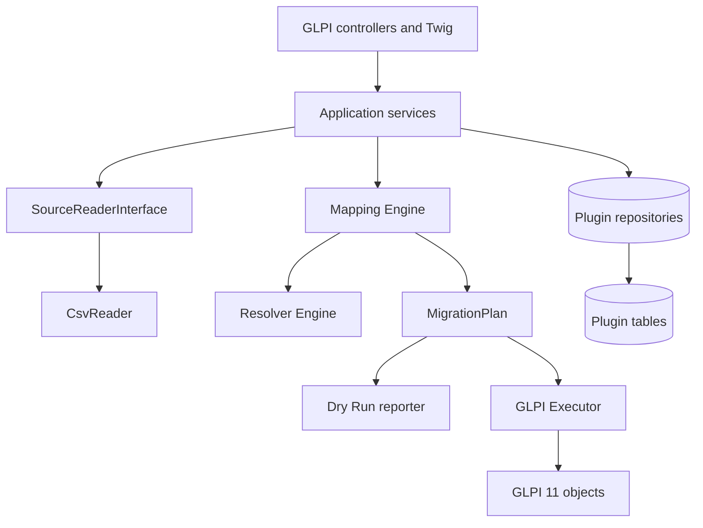

# Architecture

## Boundaries

The domain never depends on HTTP or session state. The same plan-building path feeds dry run and execution. Only the executor writes GLPI business objects.

## Components

- **Source**: streaming readers emit positional `SourceRow` values and `SourceColumn` identities (`index:name`), preserving duplicate headers.
- **Mapping**: field, constant, value-map, resolver, template, transform, structured-description, and ignore strategies produce typed target values.
- **Resolvers**: exact, normalized exact, then fuzzy suggestions. Suggestions are never automatically applied.
- **Plan**: immutable ticket aggregate containing actors, timeline, documents, relations, external reference, warnings, and errors.
- **Plan context**: permission-checked GLPI location and official `Profile_User` authorization metadata is collected outside the domain builder, which applies deterministic entity precedence without issuing database queries itself. Requester preference/unique authorization precedes location evidence. Profile-level location/entity bridges support legacy global locations; an exact unique hierarchy-name match remains only the last location fallback.
- **Execution**: converts the immutable plan into GLPI's official `Ticket::add()` input, creates GLPI objects in a controlled lifecycle with `_disablenotif`, `_skip_rules`, and `_skip_auto_assign`, and isolates a failed source row from subsequent rows. Pilot and final execution share this executor.
- **Persistence**: profiles, mappings, runs, row states, and external references remain in plugin-prefixed tables.
- **Source storage**: random internal names under `GLPI_PLUGIN_DOC_DIR/ticketmigration/sources`; metadata and retention state live in `sourcefiles`.

CSV rows are never duplicated into SQL tables. Field mappings store one compact row per source column, value mappings store one row per distinct controlled source value, and location/entity bridges store one row per resolved GLPI location requiring an override. Run items retain status, hashes, warnings, errors, and created-object identifiers rather than complete source payloads. External references and completed run history are permanent audit data.

Final runs snapshot field/value mappings, options, and the permission-checked entity-resolution context. A browser-driven worker handles bounded batches and commits a terminal state for each row. Recovering an interrupted run reuses that snapshot; applying corrected configuration creates a new run whose ledger classification skips earlier successes. This separates resumability from configuration changes and keeps each execution reproducible.

Each uploaded source receives a schema fingerprint over CSV controls and ordered positional columns. This lets a profile reject structurally incompatible delta files without relying on unique header names.

A profile explicitly references one active source revision through `sourcefiles_id`. Revisions remain auditable and selectable; choosing a structurally identical revision preserves positional mappings, while a different schema returns the workflow to mapping. Parsing controls are stored with each revision so preview and mapping always interpret that exact file consistently.

When a new revision becomes active, the previous revision receives a 30-day retention deadline. Cleanup is limited to expired, inactive payloads that are not referenced by a migration run; their small metadata record and hash remain soft-deleted for traceability. The active source and every executed source are excluded. Archived projects are read-only and retain profiles, mappings, sources, runs, and external references.

## Persistence

Frequently filtered fields are normal columns and indexed. Extensible mapping/options payloads use JSON. `profiles_id + external_id` is unique and is the technical idempotency key. The same value is also passed to GLPI 11's native `Ticket.externalid` field so it remains visible and searchable on the created ticket; plugin-scoped idempotency does not rely on that global core field. A successful pilot writes the same external-reference ledger used by final execution, so that row cannot create a second ticket later. Per-reference database advisory locking and an in-lock ledger recheck protect concurrent requests. No core table schema is changed. Uninstalling the plugin drops plugin data only; migrated tickets remain GLPI-owned.

Workflow state is persisted on the profile (`profile_created`, `source_selected`, `mapping_configured`, `values_configured`, then later dry-run/import states). It drives navigation but never substitutes for validation: readiness remains derived from the required configuration and a successful dry run.

## Dependency rule

Data Injection is an architectural reference only. Ticket Migration neither loads its classes nor reads its tables. Source reader, mapping, plan, execution, and persistence contracts belong to this plugin.
