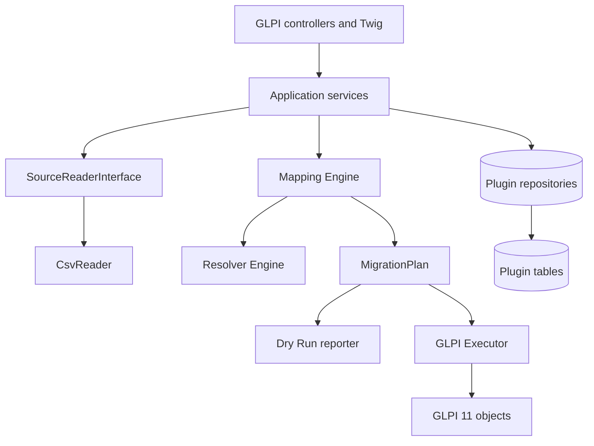

# Architecture

## Boundaries

The domain never depends on HTTP or session state. The same plan-building path feeds dry run and execution. Only the executor writes GLPI business objects.

## Components

- **Source**: streaming readers emit positional `SourceRow` values and `SourceColumn` identities (`index:name`), preserving duplicate headers.
- **Mapping**: field, constant, value-map, resolver, template, transform, structured-description, and ignore strategies produce typed target values.
- **Resolvers**: exact, normalized exact, then fuzzy suggestions. Suggestions are never automatically applied.
- **Plan**: immutable ticket aggregate containing actors, timeline, documents, relations, external reference, warnings, and errors.
- **Execution**: creates GLPI objects in a controlled lifecycle with `_disablenotif`; it isolates a failed source row from subsequent rows.
- **Persistence**: profiles, mappings, runs, row states, and external references remain in plugin-prefixed tables.
- **Source storage**: random internal names under `GLPI_PLUGIN_DOC_DIR/ticketmigration/sources`; metadata and retention state live in `sourcefiles`.

Each uploaded source receives a schema fingerprint over CSV controls and ordered positional columns. This lets a profile reject structurally incompatible delta files without relying on unique header names.

A profile explicitly references one active source revision through `sourcefiles_id`. Revisions remain auditable and selectable; choosing a structurally identical revision preserves positional mappings, while a different schema returns the workflow to mapping. Parsing controls are stored with each revision so preview and mapping always interpret that exact file consistently.

## Persistence

Frequently filtered fields are normal columns and indexed. Extensible mapping/options payloads use JSON. `profiles_id + external_id` is unique and is the technical idempotency key. No core table schema is changed. Uninstalling the plugin drops plugin data only; migrated tickets remain GLPI-owned.

Workflow state is persisted on the profile (`profile_created`, `source_selected`, `mapping_configured`, `values_configured`, then later dry-run/import states). It drives navigation but never substitutes for validation: readiness remains derived from the required configuration and a successful dry run.

## Dependency rule

Data Injection is an architectural reference only. Ticket Migration neither loads its classes nor reads its tables. Source reader, mapping, plan, execution, and persistence contracts belong to this plugin.
