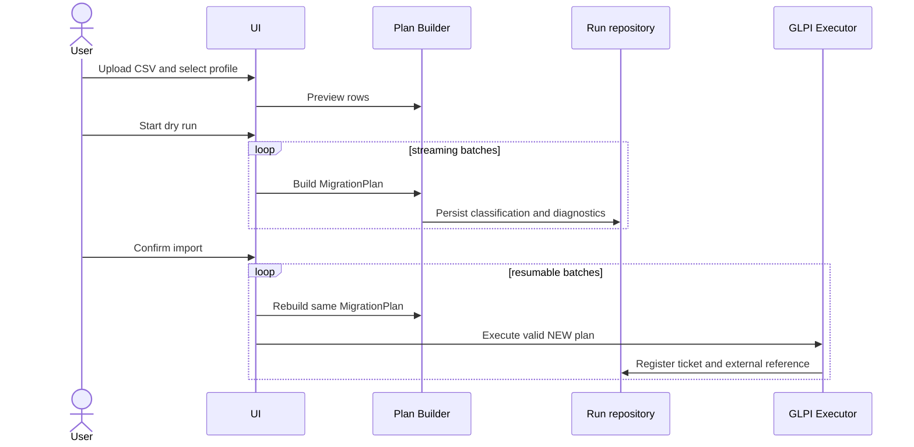

# Migration flow

Before this execution sequence, the configuration workflow is persisted and resumable: create profile → select active source revision → save positional mapping → validate resolvers/value mappings → dry run. Reopening a profile resumes at its recorded step and never requires a redundant upload. Selecting a source with a different schema fingerprint invalidates later configuration steps.

After a successful dry run and before final execution, the operator must acknowledge a recent restorable backup. The confirmation records the GLPI user, timestamp, and optional backup reference in the run. Both the UI and execution service block import when this immutable acknowledgement is absent.

Classification precedes execution: unknown external ID is `NEW`; known ID with the same canonical hash is `SKIP`; known ID with a different hash is `CHANGED`. V1 does not update `CHANGED` tickets automatically.

Conceptual creation order is ticket, actors, followups, tasks, documents, solution, relations, final status, guarded historical restoration, then external-reference registration. Integration tests against GLPI 11.0.8 must validate the exact lifecycle before enabling execution.

Runs and each row state are persisted after every batch. Closing the browser must not lose progress. Dry run may write technical report state but creates no GLPI business object.
